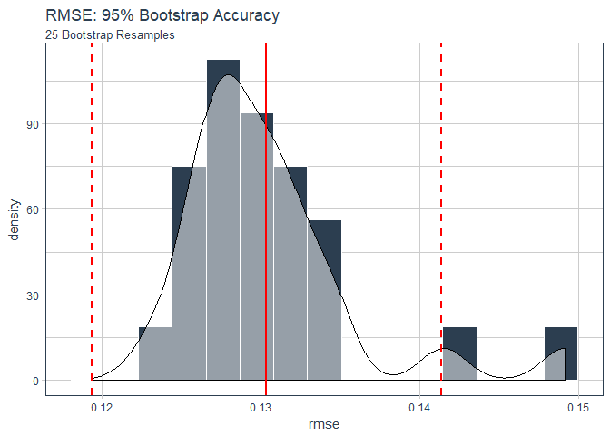

Rsample Bootstrapping with Recipes
================
Matt Dancho
December 16, 2017

Overview
========

A brief document to test out the [`rsample` package](https://topepo.github.io/rsample/index.html) from Max Kuhn. This doc covers Bootstrapping with `recipes` using the workflow discussed in the [rsample application examples](https://topepo.github.io/rsample/articles/Applications/Recipes_and_rsample.html).

Libraries
=========

``` r
library(tidyquant)
library(AmesHousing)
library(recipes)
library(rsample)
```

Boostrapping Using Recipes and Rsample
======================================

According to [Wikipedia](https://en.wikipedia.org/wiki/Bootstrapping_(statistics)),

> Bootstrapping is the practice of estimating properties of an estimator (such as its variance) by measuring those properties when sampling from an approximating distribution. One standard choice for an approximating distribution is the empirical distribution function of the observed data. In the case where a set of observations can be assumed to be from an independent and identically distributed population, this can be implemented by constructing a number of resamples with replacement, of the observed dataset (and of equal size to the observed dataset).

This example showcases combining preprocessing with `recipes` and bootstrapped resampling with `rsample`.

Data
----

Use the Ames Housing data set.

``` r
ames <- make_ames()
```

Inspect the data.

``` r
ames %>% glimpse()
```

    ## Observations: 2,911
    ## Variables: 81
    ## $ MS_SubClass        <fctr> One_Story_1946_and_Newer_All_Styles, One_S...
    ## $ MS_Zoning          <fctr> Residential_Low_Density, Residential_High_...
    ## $ Lot_Frontage       <dbl> 141, 80, 81, 93, 74, 78, 41, 43, 39, 60, 75...
    ## $ Lot_Area           <int> 31770, 11622, 14267, 11160, 13830, 9978, 49...
    ## $ Street             <fctr> Pave, Pave, Pave, Pave, Pave, Pave, Pave, ...
    ## $ Alley              <fctr> No_Alley_Access, No_Alley_Access, No_Alley...
    ## $ Lot_Shape          <fctr> Slightly_Irregular, Regular, Slightly_Irre...
    ## $ Land_Contour       <fctr> Lvl, Lvl, Lvl, Lvl, Lvl, Lvl, Lvl, HLS, Lv...
    ## $ Utilities          <fctr> AllPub, AllPub, AllPub, AllPub, AllPub, Al...
    ## $ Lot_Config         <fctr> Corner, Inside, Corner, Corner, Inside, In...
    ## $ Land_Slope         <fctr> Gtl, Gtl, Gtl, Gtl, Gtl, Gtl, Gtl, Gtl, Gt...
    ## $ Neighborhood       <fctr> North_Ames, North_Ames, North_Ames, North_...
    ## $ Condition_1        <fctr> Norm, Feedr, Norm, Norm, Norm, Norm, Norm,...
    ## $ Condition_2        <fctr> Norm, Norm, Norm, Norm, Norm, Norm, Norm, ...
    ## $ Bldg_Type          <fctr> OneFam, OneFam, OneFam, OneFam, OneFam, On...
    ## $ House_Style        <fctr> One_Story, One_Story, One_Story, One_Story...
    ## $ Overall_Qual       <fctr> Above_Average, Average, Above_Average, Goo...
    ## $ Overall_Cond       <fctr> Average, Above_Average, Above_Average, Ave...
    ## $ Year_Built         <int> 1960, 1961, 1958, 1968, 1997, 1998, 2001, 1...
    ## $ Year_Remod_Add     <int> 1960, 1961, 1958, 1968, 1998, 1998, 2001, 1...
    ## $ Roof_Style         <fctr> Hip, Gable, Hip, Hip, Gable, Gable, Gable,...
    ## $ Roof_Matl          <fctr> CompShg, CompShg, CompShg, CompShg, CompSh...
    ## $ Exterior_1st       <fctr> BrkFace, VinylSd, Wd Sdng, BrkFace, VinylS...
    ## $ Exterior_2nd       <fctr> Plywood, VinylSd, Wd Sdng, BrkFace, VinylS...
    ## $ Mas_Vnr_Type       <fctr> Stone, None, BrkFace, None, None, BrkFace,...
    ## $ Mas_Vnr_Area       <dbl> 112, 0, 108, 0, 0, 20, 0, 0, 0, 0, 0, 0, 0,...
    ## $ Exter_Qual         <fctr> Typical, Typical, Typical, Good, Typical, ...
    ## $ Exter_Cond         <fctr> Typical, Typical, Typical, Typical, Typica...
    ## $ Foundation         <fctr> CBlock, CBlock, CBlock, CBlock, PConc, PCo...
    ## $ Bsmt_Qual          <fctr> Typical, Typical, Typical, Typical, Good, ...
    ## $ Bsmt_Cond          <fctr> Good, Typical, Typical, Typical, Typical, ...
    ## $ Bsmt_Exposure      <fctr> Gd, No, No, No, No, No, Mn, No, No, No, No...
    ## $ BsmtFin_Type_1     <fctr> BLQ, Rec, ALQ, ALQ, GLQ, GLQ, GLQ, ALQ, GL...
    ## $ BsmtFin_SF_1       <dbl> 2, 6, 1, 1, 3, 3, 3, 1, 3, 7, 7, 1, 7, 3, 3...
    ## $ BsmtFin_Type_2     <fctr> Unf, LwQ, Unf, Unf, Unf, Unf, Unf, Unf, Un...
    ## $ BsmtFin_SF_2       <dbl> 0, 144, 0, 0, 0, 0, 0, 0, 0, 0, 0, 0, 0, 0,...
    ## $ Bsmt_Unf_SF        <dbl> 441, 270, 406, 1045, 137, 324, 722, 1017, 4...
    ## $ Total_Bsmt_SF      <dbl> 1080, 882, 1329, 2110, 928, 926, 1338, 1280...
    ## $ Heating            <fctr> GasA, GasA, GasA, GasA, GasA, GasA, GasA, ...
    ## $ Heating_QC         <fctr> Fair, Typical, Typical, Excellent, Good, E...
    ## $ Central_Air        <fctr> Y, Y, Y, Y, Y, Y, Y, Y, Y, Y, Y, Y, Y, Y, ...
    ## $ Electrical         <fctr> SBrkr, SBrkr, SBrkr, SBrkr, SBrkr, SBrkr, ...
    ## $ First_Flr_SF       <int> 1656, 896, 1329, 2110, 928, 926, 1338, 1280...
    ## $ Second_Flr_SF      <int> 0, 0, 0, 0, 701, 678, 0, 0, 0, 776, 892, 0,...
    ## $ Low_Qual_Fin_SF    <int> 0, 0, 0, 0, 0, 0, 0, 0, 0, 0, 0, 0, 0, 0, 0...
    ## $ Gr_Liv_Area        <int> 1656, 896, 1329, 2110, 1629, 1604, 1338, 12...
    ## $ Bsmt_Full_Bath     <dbl> 1, 0, 0, 1, 0, 0, 1, 0, 1, 0, 0, 1, 0, 1, 1...
    ## $ Bsmt_Half_Bath     <dbl> 0, 0, 0, 0, 0, 0, 0, 0, 0, 0, 0, 0, 0, 0, 0...
    ## $ Full_Bath          <int> 1, 1, 1, 2, 2, 2, 2, 2, 2, 2, 2, 2, 2, 1, 1...
    ## $ Half_Bath          <int> 0, 0, 1, 1, 1, 1, 0, 0, 0, 1, 1, 0, 1, 1, 1...
    ## $ Bedroom_AbvGr      <int> 3, 2, 3, 3, 3, 3, 2, 2, 2, 3, 3, 3, 3, 2, 1...
    ## $ Kitchen_AbvGr      <int> 1, 1, 1, 1, 1, 1, 1, 1, 1, 1, 1, 1, 1, 1, 1...
    ## $ Kitchen_Qual       <fctr> Typical, Typical, Good, Excellent, Typical...
    ## $ TotRms_AbvGrd      <int> 7, 5, 6, 8, 6, 7, 6, 5, 5, 7, 7, 6, 7, 5, 4...
    ## $ Functional         <fctr> Typ, Typ, Typ, Typ, Typ, Typ, Typ, Typ, Ty...
    ## $ Fireplaces         <int> 2, 0, 0, 2, 1, 1, 0, 0, 1, 1, 1, 0, 1, 1, 0...
    ## $ Fireplace_Qu       <fctr> Good, No_Fireplace, No_Fireplace, Typical,...
    ## $ Garage_Type        <fctr> Attchd, Attchd, Attchd, Attchd, Attchd, At...
    ## $ Garage_Finish      <fctr> Fin, Unf, Unf, Fin, Fin, Fin, Fin, RFn, RF...
    ## $ Garage_Cars        <dbl> 2, 1, 1, 2, 2, 2, 2, 2, 2, 2, 2, 2, 2, 2, 2...
    ## $ Garage_Area        <dbl> 528, 730, 312, 522, 482, 470, 582, 506, 608...
    ## $ Garage_Qual        <fctr> Typical, Typical, Typical, Typical, Typica...
    ## $ Garage_Cond        <fctr> Typical, Typical, Typical, Typical, Typica...
    ## $ Paved_Drive        <fctr> Partial_Pavement, Paved, Paved, Paved, Pav...
    ## $ Wood_Deck_SF       <int> 210, 140, 393, 0, 212, 360, 0, 0, 237, 140,...
    ## $ Open_Porch_SF      <int> 62, 0, 36, 0, 34, 36, 0, 82, 152, 60, 84, 2...
    ## $ Enclosed_Porch     <int> 0, 0, 0, 0, 0, 0, 170, 0, 0, 0, 0, 0, 0, 0,...
    ## $ Three_season_porch <int> 0, 0, 0, 0, 0, 0, 0, 0, 0, 0, 0, 0, 0, 0, 0...
    ## $ Screen_Porch       <int> 0, 120, 0, 0, 0, 0, 0, 144, 0, 0, 0, 0, 0, ...
    ## $ Pool_Area          <int> 0, 0, 0, 0, 0, 0, 0, 0, 0, 0, 0, 0, 0, 0, 0...
    ## $ Pool_QC            <fctr> No_Pool, No_Pool, No_Pool, No_Pool, No_Poo...
    ## $ Fence              <fctr> No_Fence, Minimum_Privacy, No_Fence, No_Fe...
    ## $ Misc_Feature       <fctr> None, None, Gar2, None, None, None, None, ...
    ## $ Misc_Val           <int> 0, 0, 12500, 0, 0, 0, 0, 0, 0, 0, 0, 500, 0...
    ## $ Mo_Sold            <int> 5, 6, 6, 4, 3, 6, 4, 1, 3, 6, 4, 3, 5, 2, 6...
    ## $ Year_Sold          <int> 2010, 2010, 2010, 2010, 2010, 2010, 2010, 2...
    ## $ Sale_Type          <fctr> WD , WD , WD , WD , WD , WD , WD , WD , WD...
    ## $ Sale_Condition     <fctr> Normal, Normal, Normal, Normal, Normal, No...
    ## $ Sale_Price         <int> 215000, 105000, 172000, 244000, 189900, 195...
    ## $ Longitude          <dbl> -93.61975, -93.61976, -93.61939, -93.61732,...
    ## $ Latitude           <dbl> 42.05403, 42.05301, 42.05266, 42.05125, 42....

Preprocessing with Recipes
--------------------------

Create a recipe object, which can be applied to any data set to preprocess. Steps:

1.  Create recipe - Our preprocessing plan / steps
2.  Prepare the recipe - Gets statistics
3.  Bake or Juice the prepared recipe - Processes data

``` r
rec <- recipe(Sale_Price ~ Neighborhood + House_Style + Year_Sold + Lot_Area, 
              data = ames) %>%
  # Log the outcome
  step_log(Sale_Price, base = 10) %>%
  # Collapse rarely occurring jobs into "other"
  step_other(Neighborhood, House_Style, threshold = 0.05) %>%
  # Dummy variables on the qualitative predictors
  step_dummy(all_nominal()) %>%
  # Unskew a predictor
  step_BoxCox(Lot_Area) %>%
  # Normalize
  step_center(all_predictors()) %>%
  step_scale(all_predictors()) 
rec
```

    ## Data Recipe
    ## 
    ## Inputs:
    ## 
    ##       role #variables
    ##    outcome          1
    ##  predictor          4
    ## 
    ## Steps:
    ## 
    ## Log transformation on Sale_Price
    ## Collapsing factor levels for Neighborhood, House_Style
    ## Dummy variables from all_nominal()
    ## Box-Cox transformation on Lot_Area
    ## Centering for all_predictors()
    ## Scaling for all_predictors()

Prepare the recipe using `prep()`.

``` r
rec_training_set <- prep(rec, training = ames, retain = TRUE, verbose = TRUE)
```

    ## step 1 log training 
    ## step 2 other training 
    ## step 3 dummy training 
    ## step 4 BoxCox training 
    ## step 5 center training 
    ## step 6 scale training

``` r
rec_training_set
```

    ## Data Recipe
    ## 
    ## Inputs:
    ## 
    ##       role #variables
    ##    outcome          1
    ##  predictor          4
    ## 
    ## Training data contained 2911 data points and no missing data.
    ## 
    ## Steps:
    ## 
    ## Log transformation on Sale_Price [trained]
    ## Collapsing factor levels for Neighborhood, House_Style [trained]
    ## Dummy variables from Neighborhood, House_Style [trained]
    ## Box-Cox transformation on Lot_Area [trained]
    ## Centering for Year_Sold, ... [trained]
    ## Scaling for Year_Sold, ... [trained]

Use `bake()` on newdata. Can use `juice()` as a quicker way if applying to training data.

``` r
ames_processed <- bake(rec_training_set, newdata = ames)

ames_processed %>% glimpse()
```

    ## Observations: 2,911
    ## Variables: 14
    ## $ Lot_Area                        <dbl> 2.7112088, 0.5090036, 0.934533...
    ## $ Year_Sold                       <dbl> 1.679395, 1.679395, 1.679395, ...
    ## $ Sale_Price                      <dbl> 5.332438, 5.021189, 5.235528, ...
    ## $ Neighborhood_College_Creek      <dbl> -0.3177242, -0.3177242, -0.317...
    ## $ Neighborhood_Old_Town           <dbl> -0.2969747, -0.2969747, -0.296...
    ## $ Neighborhood_Edwards            <dbl> -0.2664277, -0.2664277, -0.266...
    ## $ Neighborhood_Somerset           <dbl> -0.2582018, -0.2582018, -0.258...
    ## $ Neighborhood_Northridge_Heights <dbl> -0.2458715, -0.2458715, -0.245...
    ## $ Neighborhood_Gilbert            <dbl> -0.2450852, -0.2450852, -0.245...
    ## $ Neighborhood_Sawyer             <dbl> -0.2338618, -0.2338618, -0.233...
    ## $ Neighborhood_other              <dbl> -0.784357, -0.784357, -0.78435...
    ## $ House_Style_One_Story           <dbl> 0.9871997, 0.9871997, 0.987199...
    ## $ House_Style_Two_Story           <dbl> -0.651705, -0.651705, -0.65170...
    ## $ House_Style_other               <dbl> -0.3124557, -0.3124557, -0.312...

Bootstrapped Resampling With Rsample
------------------------------------

Creating bootstraps

``` r
bt_samples <- bootstraps(ames, times = 25)
bt_samples
```

    ## # Bootstrap sampling 
    ## # A tibble: 25 x 2
    ##          splits          id
    ##          <list>       <chr>
    ##  1 <S3: rsplit> Bootstrap01
    ##  2 <S3: rsplit> Bootstrap02
    ##  3 <S3: rsplit> Bootstrap03
    ##  4 <S3: rsplit> Bootstrap04
    ##  5 <S3: rsplit> Bootstrap05
    ##  6 <S3: rsplit> Bootstrap06
    ##  7 <S3: rsplit> Bootstrap07
    ##  8 <S3: rsplit> Bootstrap08
    ##  9 <S3: rsplit> Bootstrap09
    ## 10 <S3: rsplit> Bootstrap10
    ## # ... with 15 more rows

Inspect one of the splits.

``` r
bt_samples$splits[[1]]
```

    ## <2911/1054/2911>

Two data sets in one. Retrieve the training data with `analysis()` (aka in-sample).

``` r
analysis(bt_samples$splits[[1]])
```

    ## # A tibble: 2,911 x 81
    ##                             MS_SubClass                    MS_Zoning
    ##                                  <fctr>                       <fctr>
    ##  1         One_Story_PUD_1946_and_Newer      Residential_Low_Density
    ##  2 One_and_Half_Story_Finished_All_Ages   Residential_Medium_Density
    ##  3 One_and_Half_Story_Finished_All_Ages      Residential_Low_Density
    ##  4             Two_Story_1946_and_Newer      Residential_Low_Density
    ##  5           Duplex_All_Styles_and_Ages      Residential_Low_Density
    ##  6 One_and_Half_Story_Finished_All_Ages      Residential_Low_Density
    ##  7           Duplex_All_Styles_and_Ages      Residential_Low_Density
    ##  8             One_Story_1945_and_Older                        C_all
    ##  9             One_Story_1945_and_Older   Residential_Medium_Density
    ## 10  One_Story_1946_and_Newer_All_Styles Floating_Village_Residential
    ## # ... with 2,901 more rows, and 79 more variables: Lot_Frontage <dbl>,
    ## #   Lot_Area <int>, Street <fctr>, Alley <fctr>, Lot_Shape <fctr>,
    ## #   Land_Contour <fctr>, Utilities <fctr>, Lot_Config <fctr>,
    ## #   Land_Slope <fctr>, Neighborhood <fctr>, Condition_1 <fctr>,
    ## #   Condition_2 <fctr>, Bldg_Type <fctr>, House_Style <fctr>,
    ## #   Overall_Qual <fctr>, Overall_Cond <fctr>, Year_Built <int>,
    ## #   Year_Remod_Add <int>, Roof_Style <fctr>, Roof_Matl <fctr>,
    ## #   Exterior_1st <fctr>, Exterior_2nd <fctr>, Mas_Vnr_Type <fctr>,
    ## #   Mas_Vnr_Area <dbl>, Exter_Qual <fctr>, Exter_Cond <fctr>,
    ## #   Foundation <fctr>, Bsmt_Qual <fctr>, Bsmt_Cond <fctr>,
    ## #   Bsmt_Exposure <fctr>, BsmtFin_Type_1 <fctr>, BsmtFin_SF_1 <dbl>,
    ## #   BsmtFin_Type_2 <fctr>, BsmtFin_SF_2 <dbl>, Bsmt_Unf_SF <dbl>,
    ## #   Total_Bsmt_SF <dbl>, Heating <fctr>, Heating_QC <fctr>,
    ## #   Central_Air <fctr>, Electrical <fctr>, First_Flr_SF <int>,
    ## #   Second_Flr_SF <int>, Low_Qual_Fin_SF <int>, Gr_Liv_Area <int>,
    ## #   Bsmt_Full_Bath <dbl>, Bsmt_Half_Bath <dbl>, Full_Bath <int>,
    ## #   Half_Bath <int>, Bedroom_AbvGr <int>, Kitchen_AbvGr <int>,
    ## #   Kitchen_Qual <fctr>, TotRms_AbvGrd <int>, Functional <fctr>,
    ## #   Fireplaces <int>, Fireplace_Qu <fctr>, Garage_Type <fctr>,
    ## #   Garage_Finish <fctr>, Garage_Cars <dbl>, Garage_Area <dbl>,
    ## #   Garage_Qual <fctr>, Garage_Cond <fctr>, Paved_Drive <fctr>,
    ## #   Wood_Deck_SF <int>, Open_Porch_SF <int>, Enclosed_Porch <int>,
    ## #   Three_season_porch <int>, Screen_Porch <int>, Pool_Area <int>,
    ## #   Pool_QC <fctr>, Fence <fctr>, Misc_Feature <fctr>, Misc_Val <int>,
    ## #   Mo_Sold <int>, Year_Sold <int>, Sale_Type <fctr>,
    ## #   Sale_Condition <fctr>, Sale_Price <int>, Longitude <dbl>,
    ## #   Latitude <dbl>

Retrieve the testing set with `assessment()` (aka out-of-bag sample).

``` r
assessment(bt_samples$splits[[1]])
```

    ## # A tibble: 1,054 x 81
    ##                            MS_SubClass                    MS_Zoning
    ##                                 <fctr>                       <fctr>
    ##  1 One_Story_1946_and_Newer_All_Styles      Residential_Low_Density
    ##  2            Two_Story_1946_and_Newer      Residential_Low_Density
    ##  3            Two_Story_1946_and_Newer      Residential_Low_Density
    ##  4 One_Story_1946_and_Newer_All_Styles      Residential_Low_Density
    ##  5 One_Story_1946_and_Newer_All_Styles      Residential_Low_Density
    ##  6            Two_Story_1946_and_Newer Floating_Village_Residential
    ##  7 One_Story_1946_and_Newer_All_Styles      Residential_Low_Density
    ##  8 One_Story_1946_and_Newer_All_Styles      Residential_Low_Density
    ##  9 One_Story_1946_and_Newer_All_Styles      Residential_Low_Density
    ## 10            Two_Story_1946_and_Newer      Residential_Low_Density
    ## # ... with 1,044 more rows, and 79 more variables: Lot_Frontage <dbl>,
    ## #   Lot_Area <int>, Street <fctr>, Alley <fctr>, Lot_Shape <fctr>,
    ## #   Land_Contour <fctr>, Utilities <fctr>, Lot_Config <fctr>,
    ## #   Land_Slope <fctr>, Neighborhood <fctr>, Condition_1 <fctr>,
    ## #   Condition_2 <fctr>, Bldg_Type <fctr>, House_Style <fctr>,
    ## #   Overall_Qual <fctr>, Overall_Cond <fctr>, Year_Built <int>,
    ## #   Year_Remod_Add <int>, Roof_Style <fctr>, Roof_Matl <fctr>,
    ## #   Exterior_1st <fctr>, Exterior_2nd <fctr>, Mas_Vnr_Type <fctr>,
    ## #   Mas_Vnr_Area <dbl>, Exter_Qual <fctr>, Exter_Cond <fctr>,
    ## #   Foundation <fctr>, Bsmt_Qual <fctr>, Bsmt_Cond <fctr>,
    ## #   Bsmt_Exposure <fctr>, BsmtFin_Type_1 <fctr>, BsmtFin_SF_1 <dbl>,
    ## #   BsmtFin_Type_2 <fctr>, BsmtFin_SF_2 <dbl>, Bsmt_Unf_SF <dbl>,
    ## #   Total_Bsmt_SF <dbl>, Heating <fctr>, Heating_QC <fctr>,
    ## #   Central_Air <fctr>, Electrical <fctr>, First_Flr_SF <int>,
    ## #   Second_Flr_SF <int>, Low_Qual_Fin_SF <int>, Gr_Liv_Area <int>,
    ## #   Bsmt_Full_Bath <dbl>, Bsmt_Half_Bath <dbl>, Full_Bath <int>,
    ## #   Half_Bath <int>, Bedroom_AbvGr <int>, Kitchen_AbvGr <int>,
    ## #   Kitchen_Qual <fctr>, TotRms_AbvGrd <int>, Functional <fctr>,
    ## #   Fireplaces <int>, Fireplace_Qu <fctr>, Garage_Type <fctr>,
    ## #   Garage_Finish <fctr>, Garage_Cars <dbl>, Garage_Area <dbl>,
    ## #   Garage_Qual <fctr>, Garage_Cond <fctr>, Paved_Drive <fctr>,
    ## #   Wood_Deck_SF <int>, Open_Porch_SF <int>, Enclosed_Porch <int>,
    ## #   Three_season_porch <int>, Screen_Porch <int>, Pool_Area <int>,
    ## #   Pool_QC <fctr>, Fence <fctr>, Misc_Feature <fctr>, Misc_Val <int>,
    ## #   Mo_Sold <int>, Year_Sold <int>, Sale_Type <fctr>,
    ## #   Sale_Condition <fctr>, Sale_Price <int>, Longitude <dbl>,
    ## #   Latitude <dbl>

Create individual recipes for each bootstrap resample. Use a special function `prepper()` instead of `prep()`, which helps looping through resamples (split objects).

``` r
bt_samples <- bt_samples %>%
    mutate(recipes = map(splits, ~ prepper(split_obj = .x, recipe = rec, retain = TRUE)))

bt_samples
```

    ## # Bootstrap sampling 
    ## # A tibble: 25 x 3
    ##          splits          id      recipes
    ##  *       <list>       <chr>       <list>
    ##  1 <S3: rsplit> Bootstrap01 <S3: recipe>
    ##  2 <S3: rsplit> Bootstrap02 <S3: recipe>
    ##  3 <S3: rsplit> Bootstrap03 <S3: recipe>
    ##  4 <S3: rsplit> Bootstrap04 <S3: recipe>
    ##  5 <S3: rsplit> Bootstrap05 <S3: recipe>
    ##  6 <S3: rsplit> Bootstrap06 <S3: recipe>
    ##  7 <S3: rsplit> Bootstrap07 <S3: recipe>
    ##  8 <S3: rsplit> Bootstrap08 <S3: recipe>
    ##  9 <S3: rsplit> Bootstrap09 <S3: recipe>
    ## 10 <S3: rsplit> Bootstrap10 <S3: recipe>
    ## # ... with 15 more rows

Map our modeling function. We'll just use a simple `lm()` function.

``` r
bt_samples <- bt_samples %>%
    mutate(fit = map(recipes, ~ lm(Sale_Price ~ ., data = juice(.x, everything()))))

bt_samples
```

    ## # Bootstrap sampling 
    ## # A tibble: 25 x 4
    ##          splits          id      recipes      fit
    ##  *       <list>       <chr>       <list>   <list>
    ##  1 <S3: rsplit> Bootstrap01 <S3: recipe> <S3: lm>
    ##  2 <S3: rsplit> Bootstrap02 <S3: recipe> <S3: lm>
    ##  3 <S3: rsplit> Bootstrap03 <S3: recipe> <S3: lm>
    ##  4 <S3: rsplit> Bootstrap04 <S3: recipe> <S3: lm>
    ##  5 <S3: rsplit> Bootstrap05 <S3: recipe> <S3: lm>
    ##  6 <S3: rsplit> Bootstrap06 <S3: recipe> <S3: lm>
    ##  7 <S3: rsplit> Bootstrap07 <S3: recipe> <S3: lm>
    ##  8 <S3: rsplit> Bootstrap08 <S3: recipe> <S3: lm>
    ##  9 <S3: rsplit> Bootstrap09 <S3: recipe> <S3: lm>
    ## 10 <S3: rsplit> Bootstrap10 <S3: recipe> <S3: lm>
    ## # ... with 15 more rows

Create our prediction function. Takes a split, recipe and model.

``` r
pred_lm <- function(split_obj, rec_obj, model_obj, ...) {
  
    mod_data <- bake(
        rec_obj, 
        newdata = assessment(split_obj),
        all_predictors(),
        all_outcomes()
    ) 
  
    ret <- mod_data %>% 
        select(Sale_Price) %>%
        rename(actual = Sale_Price) %>%
        mutate(predict = predict(model_obj, newdata = mod_data %>% select(-Sale_Price)))
    
    return(ret)
}
```

Test the `pred_lm()` function out.

``` r
pred_lm(
    split_obj = bt_samples$splits[[1]], 
    rec_obj   = bt_samples$recipes[[1]],
    model_obj = bt_samples$fit[[1]]
    )
```

    ## # A tibble: 1,054 x 2
    ##      actual  predict
    ##       <dbl>    <dbl>
    ##  1 5.332438 5.308145
    ##  2 5.245266 5.273952
    ##  3 5.256237 5.251121
    ##  4 5.234264 5.226863
    ##  5 5.322219 5.276163
    ##  6 5.334454 5.386429
    ##  7 5.100371 5.126792
    ##  8 5.596808 5.457845
    ##  9 5.439333 5.474513
    ## 10 5.505150 5.546621
    ## # ... with 1,044 more rows

Map the prediction function using `pmap()`.

``` r
bt_samples <- bt_samples %>%
    mutate(pred = pmap(list(splits, recipes, fit), pred_lm))

bt_samples
```

    ## # Bootstrap sampling 
    ## # A tibble: 25 x 5
    ##          splits          id      recipes      fit                 pred
    ##  *       <list>       <chr>       <list>   <list>               <list>
    ##  1 <S3: rsplit> Bootstrap01 <S3: recipe> <S3: lm> <tibble [1,054 x 2]>
    ##  2 <S3: rsplit> Bootstrap02 <S3: recipe> <S3: lm> <tibble [1,053 x 2]>
    ##  3 <S3: rsplit> Bootstrap03 <S3: recipe> <S3: lm> <tibble [1,076 x 2]>
    ##  4 <S3: rsplit> Bootstrap04 <S3: recipe> <S3: lm> <tibble [1,072 x 2]>
    ##  5 <S3: rsplit> Bootstrap05 <S3: recipe> <S3: lm> <tibble [1,071 x 2]>
    ##  6 <S3: rsplit> Bootstrap06 <S3: recipe> <S3: lm> <tibble [1,086 x 2]>
    ##  7 <S3: rsplit> Bootstrap07 <S3: recipe> <S3: lm> <tibble [1,107 x 2]>
    ##  8 <S3: rsplit> Bootstrap08 <S3: recipe> <S3: lm> <tibble [1,077 x 2]>
    ##  9 <S3: rsplit> Bootstrap09 <S3: recipe> <S3: lm> <tibble [1,056 x 2]>
    ## 10 <S3: rsplit> Bootstrap10 <S3: recipe> <S3: lm> <tibble [1,058 x 2]>
    ## # ... with 15 more rows

Calculate RMSE.

``` r
bt_samples <- bt_samples %>%
    mutate(rmse = map_dbl(pred, ~ sqrt(mean((.x$actual - .x$predict)^2))))

bt_samples
```

    ## # Bootstrap sampling 
    ## # A tibble: 25 x 6
    ##          splits          id      recipes      fit                 pred
    ##  *       <list>       <chr>       <list>   <list>               <list>
    ##  1 <S3: rsplit> Bootstrap01 <S3: recipe> <S3: lm> <tibble [1,054 x 2]>
    ##  2 <S3: rsplit> Bootstrap02 <S3: recipe> <S3: lm> <tibble [1,053 x 2]>
    ##  3 <S3: rsplit> Bootstrap03 <S3: recipe> <S3: lm> <tibble [1,076 x 2]>
    ##  4 <S3: rsplit> Bootstrap04 <S3: recipe> <S3: lm> <tibble [1,072 x 2]>
    ##  5 <S3: rsplit> Bootstrap05 <S3: recipe> <S3: lm> <tibble [1,071 x 2]>
    ##  6 <S3: rsplit> Bootstrap06 <S3: recipe> <S3: lm> <tibble [1,086 x 2]>
    ##  7 <S3: rsplit> Bootstrap07 <S3: recipe> <S3: lm> <tibble [1,107 x 2]>
    ##  8 <S3: rsplit> Bootstrap08 <S3: recipe> <S3: lm> <tibble [1,077 x 2]>
    ##  9 <S3: rsplit> Bootstrap09 <S3: recipe> <S3: lm> <tibble [1,056 x 2]>
    ## 10 <S3: rsplit> Bootstrap10 <S3: recipe> <S3: lm> <tibble [1,058 x 2]>
    ## # ... with 15 more rows, and 1 more variables: rmse <dbl>

Visualize the RMSE distribution bootstrapped resamples.

``` r
bt_samples %>%
    ggplot(aes(rmse)) +
    geom_histogram(aes(y = ..density..), bins = 15, fill = palette_light()[[1]], color = "white") +
    geom_density(aes(y = ..density..), fill = "white", alpha = 0.5) + 
    geom_vline(aes(xintercept = mean(rmse)), color = "red", size = 1) + 
    geom_vline(aes(xintercept = mean(rmse) + 2*sd(rmse)), linetype = 2, color = "red", size = 1) +
    geom_vline(aes(xintercept = mean(rmse) - 2*sd(rmse)), linetype = 2, color = "red", size = 1) +
    theme_tq() +
    labs(title = "RMSE: 95% Bootstrap Accuracy", subtitle = "25 Bootstrap Resamples")
```



Quantile.

``` r
bt_samples %>%
    pull(rmse) %>%
    quantile(probs = c(0, 0.025, 0.25, 0.5, 0.75, 0.975, 1))
```

    ##        0%      2.5%       25%       50%       75%     97.5%      100% 
    ## 0.1229674 0.1242437 0.1273490 0.1289212 0.1314461 0.1445605 0.1491535
