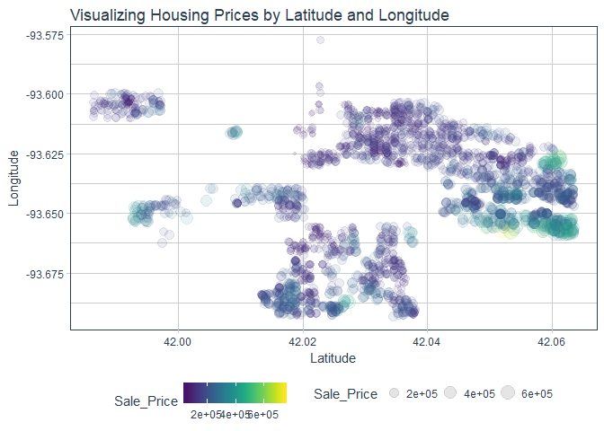

Rsample Keras Parameter Tuning Evaluation
================
Matt Dancho
December 18, 2017

Overview
========

A brief document to test out the [`rsample` package](https://topepo.github.io/rsample/index.html) from Max Kuhn. This doc covers Keras model parameter tuning using the workflow discussed in the [rsample application examples](https://topepo.github.io/rsample/articles/Applications/Keras.html).

Libraries
=========

``` r
library(tidyquant)
library(keras)
library(rsample)
library(recipes)
library(yardstick)
library(AmesHousing)
library(viridis)
```

Keras
=====

The [R Interface to Keras](https://tensorflow.rstudio.com/keras/) is used to develop high-level neural networks. The `rsample` package can be used to tune the hyperparameters using Grid Search.

Data
----

``` r
ames <- make_ames() %>%
  select(Sale_Price, Longitude, Latitude)

ames
```

    ## # A tibble: 2,911 x 3
    ##    Sale_Price Longitude Latitude
    ##         <int>     <dbl>    <dbl>
    ##  1     215000 -93.61975 42.05403
    ##  2     105000 -93.61976 42.05301
    ##  3     172000 -93.61939 42.05266
    ##  4     244000 -93.61732 42.05125
    ##  5     189900 -93.63893 42.06090
    ##  6     195500 -93.63893 42.06078
    ##  7     213500 -93.63379 42.06298
    ##  8     191500 -93.63383 42.06073
    ##  9     236500 -93.63285 42.06112
    ## 10     189000 -93.63907 42.05919
    ## # ... with 2,901 more rows

Visualize the data.

``` r
ames %>%
    ggplot(aes(x = Latitude, y = Longitude, size = Sale_Price, color = Sale_Price)) +
    geom_point(alpha = 0.1) +
    theme_tq() +
    scale_color_viridis() +
    labs(title = "Visualizing Housing Prices by Latitude and Longitude")
```



Preprocessing
-------------

Split the object into training (analysis) and testing (assessment) sets.

``` r
set.seed(4595)
data_split <- initial_split(ames, prop = 0.75, strata = "Sale_Price")

data_split
```

    ## <2186/725/2911>

We can retreive the testing set using `analysis()`.

``` r
analysis(data_split)
```

    ## # A tibble: 2,186 x 3
    ##    Sale_Price Longitude Latitude
    ##         <int>     <dbl>    <dbl>
    ##  1     215000 -93.61975 42.05403
    ##  2     189900 -93.63893 42.06090
    ##  3     213500 -93.63379 42.06298
    ##  4     191500 -93.63383 42.06073
    ##  5     236500 -93.63285 42.06112
    ##  6     189000 -93.63907 42.05919
    ##  7     175900 -93.63695 42.05848
    ##  8     171500 -93.63463 42.05727
    ##  9     212000 -93.63291 42.05917
    ## 10     164000 -93.62360 42.06035
    ## # ... with 2,176 more rows

Function to plot histogram of variables.

``` r
plot_hist_facet <- function(data, bins = 10, fill = "blue", color = "white", ncol = 5, scale = "free") {
    
    data %>%
        mutate_if(is.factor, as.numeric) %>%
        gather(key = key, value = value) %>%
        ggplot(aes(x = value, group = key)) +
        geom_histogram(bins = bins, fill = fill, color = color) +
        facet_wrap(~ key, ncol = ncol, scale = scale) + 
        theme_tq()
    
}
```

Plot the histogram of the variables prior to processing. We can see that Sale\_Price is skewed and that latitude/longitude need to be scaled and centered.

``` r
plot_hist_facet(ames, bins = 30, ncol = 2, fill = palette_light()[[1]]) +
    labs(title = "Ames: Before Processing")
```


The only preprocessing will be log transform of Sale Price and centering and scaling Latitude and Longitude.

``` r
rec <- data_split %>%
    analysis() %>%
    recipe(~ .) %>%
    step_log(Sale_Price) %>%
    step_center(Latitude, Longitude) %>%
    step_scale(Latitude, Longitude) %>%
    prep(training = analysis(data_split))

rec
```

    ## Data Recipe
    ## 
    ## Inputs:
    ## 
    ##       role #variables
    ##  predictor          3
    ## 
    ## Training data contained 2186 data points and no missing data.
    ## 
    ## Steps:
    ## 
    ## Log transformation on Sale_Price [trained]
    ## Centering for Latitude, Longitude [trained]
    ## Scaling for Latitude, Longitude [trained]

Preprocess training and testing sets.

``` r
ames_train <- analysis(ames) %>% bake(object = rec)
ames_test  <- assessment(ames) %>% bake(object = rec)
```

``` r
plot_hist_facet(ames_train, bins = 30, ncol = 2, fill = palette_light()[[1]]) +
    labs(title = "Ames: After Processing")
```


Cross Validation
----------------

`rsample` makes it easy to setup cross validation sets. We can make v-fold (aka k-fold) cross validation sets without replicating data v (or k) times.

``` r
set.seed(2453)
cv_splits <- vfold_cv(ames_train, v = 5, repeats = 1, strata = "Sale_Price")

cv_splits
```

    ## #  5-fold cross-validation using stratification 
    ## # A tibble: 5 x 2
    ##         splits    id
    ##         <list> <chr>
    ## 1 <S3: rsplit> Fold1
    ## 2 <S3: rsplit> Fold2
    ## 3 <S3: rsplit> Fold3
    ## 4 <S3: rsplit> Fold4
    ## 5 <S3: rsplit> Fold5

Grid Search + Cross Validation
------------------------------

It's common to combine grid search with cross validation to determine the best metrics.

First, create a function to return RMSE of hold out set.

``` r
mlp_rmse <- function(split, units, dropout, epoch, batch_size = 25, ...) {
 
    set.seed(4109)
 
    on.exit(keras::backend()$clear_session())
  
    # Define a single layer MLP with dropout and ReLUs
    model <- keras_model_sequential()
  
    model %>% 
        layer_dense(
            units              = units, 
            activation         = 'relu', 
            input_shape        = 2,
            kernel_initializer = initializer_glorot_uniform()
        ) %>% 
        layer_dropout(rate = dropout) %>% 
        layer_dense(units = 1, activation = "linear")

    model %>% compile(
        loss      = 'mean_squared_error',
        optimizer = optimizer_rmsprop(),
        metrics   = 'mean_squared_error'
    )
  
    # Format the data
    model_data <- analysis(split)
    
    # The data used for modeling (aka the "analysis" set)
    x_train <- model_data %>%
        select(-Sale_Price) %>%
        as.matrix()
    
    y_train <- model_data %>%
        pull(Sale_Price) 
    
    model %>% 
        fit(x = x_train, y = y_train, epochs = epoch, batch_size = batch_size, ...)
    
    # Now obtain the holdout set for prediction
    holdout_data <- assessment(split)
    
    x_test <- holdout_data %>%
        select(-Sale_Price) %>%
        as.matrix()
    
    y_test <- holdout_data %>%
        pull(Sale_Price) 
    
    holdout_data <- holdout_data %>%
        mutate(predict = predict(model, x = x_test)[,1])
    
    holdout_data %>%
        select(Sale_Price, predict) %>%
        rename(actual = Sale_Price) %>%
        # mutate(actual = exp(actual), predict = exp(predict)) %>%
        rmse(truth = actual, estimate = predict)
}
```

Next, create the grid search combining parameters with the cross validation id's.

``` r
grid_search_cv <- list(
    epoch = c(50, 100, 150),
    id    = cv_splits$id
    ) %>%
    cross_df() %>%
    left_join(cv_splits, by = "id")

grid_search_cv
```

    ## # A tibble: 15 x 3
    ##    epoch    id       splits
    ##    <dbl> <chr>       <list>
    ##  1    50 Fold1 <S3: rsplit>
    ##  2   100 Fold1 <S3: rsplit>
    ##  3   150 Fold1 <S3: rsplit>
    ##  4    50 Fold2 <S3: rsplit>
    ##  5   100 Fold2 <S3: rsplit>
    ##  6   150 Fold2 <S3: rsplit>
    ##  7    50 Fold3 <S3: rsplit>
    ##  8   100 Fold3 <S3: rsplit>
    ##  9   150 Fold3 <S3: rsplit>
    ## 10    50 Fold4 <S3: rsplit>
    ## 11   100 Fold4 <S3: rsplit>
    ## 12   150 Fold4 <S3: rsplit>
    ## 13    50 Fold5 <S3: rsplit>
    ## 14   100 Fold5 <S3: rsplit>
    ## 15   150 Fold5 <S3: rsplit>

Perform the grid search using `pmap_dbl()`. This may take 15 minutes or so. For a real problem we would add many more parameters to the grid such as units, dropout and so on. The grid search with extra parameters could take several hours or more.

``` r
grid_search_cv_results <- grid_search_cv %>%
    mutate(rmse = pmap_dbl(.l = list(split = splits, epoch = epoch), 
                           .f = mlp_rmse, units = 10, dropout = 0.4, batch_size = 25))
```

``` r
grid_search_cv_results
```

    ## # A tibble: 15 x 4
    ##    epoch    id       splits      rmse
    ##    <dbl> <chr>       <list>     <dbl>
    ##  1    50 Fold1 <S3: rsplit> 0.7553439
    ##  2   100 Fold1 <S3: rsplit> 0.5593030
    ##  3   150 Fold1 <S3: rsplit> 0.3940262
    ##  4    50 Fold2 <S3: rsplit> 0.9469077
    ##  5   100 Fold2 <S3: rsplit> 0.4832790
    ##  6   150 Fold2 <S3: rsplit> 0.3633234
    ##  7    50 Fold3 <S3: rsplit> 0.6706756
    ##  8   100 Fold3 <S3: rsplit> 0.6131420
    ##  9   150 Fold3 <S3: rsplit> 0.3834275
    ## 10    50 Fold4 <S3: rsplit> 0.8326508
    ## 11   100 Fold4 <S3: rsplit> 0.4723184
    ## 12   150 Fold4 <S3: rsplit> 0.3568057
    ## 13    50 Fold5 <S3: rsplit> 0.7468508
    ## 14   100 Fold5 <S3: rsplit> 0.4357961
    ## 15   150 Fold5 <S3: rsplit> 0.3744814

``` r
grid_search_cv_results %>%
    ggplot(aes(x = epoch, y = rmse)) +
    geom_line(aes(group = id), alpha = 0.5, color = palette_light()[[1]]) +
    geom_line(color = palette_light()[[1]], size = 1, 
              data = grid_search_cv_results %>% 
                  group_by(epoch) %>%
                  summarize(rmse = mean(rmse))) +
    expand_limits(y = 0) +
    theme_tq() +
    labs(title = "Grid Search CV Results")
```


Potential Grid Search CV Function
---------------------------------

One possible helper function to prepare a grid search with CV splits integrated.

``` r
grid_search_cv <- function(split_obj, ...) {
    .dots <- list(...)
    
    .dots %>%
        append(list(id = split_obj$id)) %>%
    purrr::cross_df() %>%
    dplyr::left_join(split_obj, by = "id")
}
```

This allows users to quickly update parameters with the splits integrated. Here's a quick example.

``` r
grid_search_cv(cv_splits, 
               epoch = c(50, 100, 150), 
               units = c(5, 10, 15, 20))
```

    ## # A tibble: 60 x 4
    ##    epoch units    id       splits
    ##    <dbl> <dbl> <chr>       <list>
    ##  1    50     5 Fold1 <S3: rsplit>
    ##  2   100     5 Fold1 <S3: rsplit>
    ##  3   150     5 Fold1 <S3: rsplit>
    ##  4    50    10 Fold1 <S3: rsplit>
    ##  5   100    10 Fold1 <S3: rsplit>
    ##  6   150    10 Fold1 <S3: rsplit>
    ##  7    50    15 Fold1 <S3: rsplit>
    ##  8   100    15 Fold1 <S3: rsplit>
    ##  9   150    15 Fold1 <S3: rsplit>
    ## 10    50    20 Fold1 <S3: rsplit>
    ## # ... with 50 more rows

Performing a cross validated grid search is as easy as mapping the modeling function with `pmap()` as shown previously.
