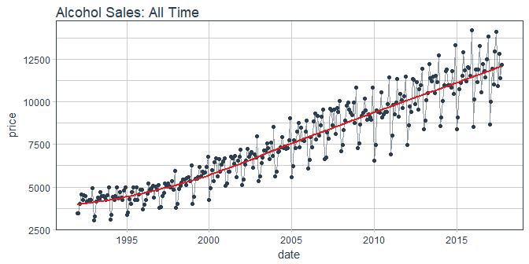
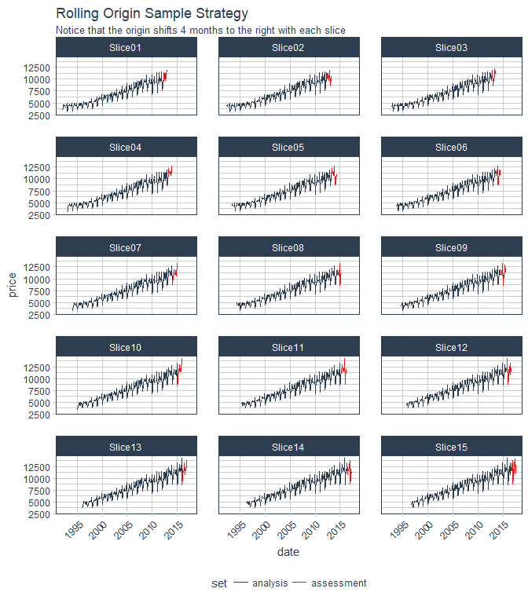
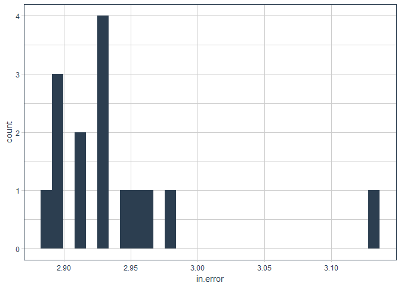
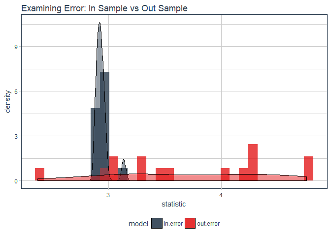

Rsample Time Series Evaluation
================
Matt Dancho
December 16, 2017

Overview
========

A brief document to test out the [`rsample` package](https://topepo.github.io/rsample/index.html) from Max Kuhn. This doc covers Time Series using the workflow discussed in the [rsample application examples](https://topepo.github.io/rsample/articles/Applications/Time_Series.html).

Libraries
=========

``` r
library(tidyquant)
library(rsample)
library(forecast)
library(sweep)
library(timetk)
```

Time Series
===========

A great article on [time series cross validation](https://robjhyndman.com/hyndsight/tscv/) discusses the procedure for using cummulative resampling. Another option is rolling origin resampling which keeps a fixed window and progressively increases the origin. Either way are good approaches to cross validation for time series.

Data
----

``` r
beer_sales <- tq_get("S4248SM144NCEN", get = "economic.data", from = "1990-01-01", to = as.character(today()))

beer_sales
```

    ## # A tibble: 310 x 2
    ##          date price
    ##        <date> <int>
    ##  1 1992-01-01  3459
    ##  2 1992-02-01  3458
    ##  3 1992-03-01  4002
    ##  4 1992-04-01  4564
    ##  5 1992-05-01  4221
    ##  6 1992-06-01  4529
    ##  7 1992-07-01  4466
    ##  8 1992-08-01  4137
    ##  9 1992-09-01  4126
    ## 10 1992-10-01  4259
    ## # ... with 300 more rows

Visualize the data.

``` r
beer_sales %>%
    ggplot(aes(x = date, y = price)) +
    geom_line(color = palette_light()[[1]], alpha = 0.5) +
    geom_point(color = palette_light()[[1]], alpha = 1) +
    geom_smooth(color = palette_light()[[2]], se = FALSE) +
    theme_tq() +
    labs(title = "Alcohol Sales: All Time")
```



Rolling Origin Resamples
------------------------

Create some rolling origin samples. Set `initial = 12 * 20` to return 20 years of samples. I set `skip = 3` to reduce the number of resamples to 15. I set `cumulative = FALSE` to switch to rolling window resampling.

``` r
ro_samples <- beer_sales %>%
    rolling_origin(initial = 12 * 20, assess = 12, skip = 3, cumulative = FALSE)

ro_samples
```

    ## # Rolling origin forecast resampling 
    ## # A tibble: 15 x 2
    ##          splits      id
    ##          <list>   <chr>
    ##  1 <S3: rsplit> Slice01
    ##  2 <S3: rsplit> Slice02
    ##  3 <S3: rsplit> Slice03
    ##  4 <S3: rsplit> Slice04
    ##  5 <S3: rsplit> Slice05
    ##  6 <S3: rsplit> Slice06
    ##  7 <S3: rsplit> Slice07
    ##  8 <S3: rsplit> Slice08
    ##  9 <S3: rsplit> Slice09
    ## 10 <S3: rsplit> Slice10
    ## 11 <S3: rsplit> Slice11
    ## 12 <S3: rsplit> Slice12
    ## 13 <S3: rsplit> Slice13
    ## 14 <S3: rsplit> Slice14
    ## 15 <S3: rsplit> Slice15

Visualize the sample strategy.

``` r
ro_samples %>%
    mutate(data = map(splits, ~ bind_rows(analysis = analysis(.x), assessment = assessment(.x), .id = "set"))) %>%
    select(id, data) %>%
    unnest() %>%
    group_by(id) %>%
    ggplot(aes(x = date, y = price, group = id, color = set)) +
    geom_line() +
    facet_wrap(~ id, ncol = 3) +
    theme_tq() +
    scale_color_tq() +
    labs(title = "Rolling Origin Sample Strategy",
         subtitle = "Notice that the origin shifts 4 months to the right with each slice") +
    theme(axis.text.x = element_text(angle = 45, hjust = 1))
```



Create the modeling function using the pipe of rsplit object:

-   `analysis()` - Extracts our test data in tibble form
-   `tk_ts()` - Converts to ts object
-   `auto.arima()` - produces the arima model

``` r
fit_arima <- function(x, ...) {
    x %>%
        analysis() %>%
        tk_ts(start  = .$date[[1]] %>% as.yearmon(), 
              freq   = 12, 
              silent = TRUE) %>%
        auto.arima(...)
}
```

Map our modeling function to the splits. This may take 30 seconds or so because of the `auto.arima()` function being applied to 15 training sets.

``` r
ro_samples <- ro_samples %>%
    mutate(arima = map(splits, fit_arima))
```

The arima column has been added to the data frame.

``` r
ro_samples
```

    ## # Rolling origin forecast resampling 
    ## # A tibble: 15 x 3
    ##          splits      id       arima
    ##  *       <list>   <chr>      <list>
    ##  1 <S3: rsplit> Slice01 <S3: ARIMA>
    ##  2 <S3: rsplit> Slice02 <S3: ARIMA>
    ##  3 <S3: rsplit> Slice03 <S3: ARIMA>
    ##  4 <S3: rsplit> Slice04 <S3: ARIMA>
    ##  5 <S3: rsplit> Slice05 <S3: ARIMA>
    ##  6 <S3: rsplit> Slice06 <S3: ARIMA>
    ##  7 <S3: rsplit> Slice07 <S3: ARIMA>
    ##  8 <S3: rsplit> Slice08 <S3: ARIMA>
    ##  9 <S3: rsplit> Slice09 <S3: ARIMA>
    ## 10 <S3: rsplit> Slice10 <S3: ARIMA>
    ## 11 <S3: rsplit> Slice11 <S3: ARIMA>
    ## 12 <S3: rsplit> Slice12 <S3: ARIMA>
    ## 13 <S3: rsplit> Slice13 <S3: ARIMA>
    ## 14 <S3: rsplit> Slice14 <S3: ARIMA>
    ## 15 <S3: rsplit> Slice15 <S3: ARIMA>

In Sample Error
---------------

Inspect insample error of the resamples.

``` r
ro_samples <- ro_samples %>%
    mutate(in.error = map_dbl(arima, ~ sw_glance(.x) %>% pull(MAPE))) 
```

Visualize the in sample error.

``` r
ro_samples %>%
    ggplot(aes(in.error)) +
    geom_histogram(fill = palette_light()[[1]]) +
    theme_tq()
```



Forecast
--------

Create a prediction function, `pred_arima()`, that returns the actual and forecasted values. It takes a split object and and model object creating the prediction (forecast) using the `forecast()` function.

``` r
pred_arima <- function(x, model_obj, ...) {
    
    h <- nrow(assessment(x))
    
    fcast <- forecast(model_obj, h = h, ...)
    
    ret <- x %>%
        assessment() %>%
        rename(actual = price) %>%
        mutate(pred   = fcast$mean %>% as.numeric())
    
    return(ret)
}
```

Test the prediction function on one of the resamples.

``` r
pred_arima(x = ro_samples$splits[[1]], model_obj = ro_samples$arima[[1]])
```

    ## # A tibble: 12 x 3
    ##          date actual      pred
    ##        <date>  <int>     <dbl>
    ##  1 2012-01-01   7486  7535.944
    ##  2 2012-02-01   8641  8506.484
    ##  3 2012-03-01   9709  9796.854
    ##  4 2012-04-01   9423  9564.485
    ##  5 2012-05-01  11342 10443.745
    ##  6 2012-06-01  11274 11449.639
    ##  7 2012-07-01   9845  9695.809
    ##  8 2012-08-01  11163 10761.022
    ##  9 2012-09-01   9532 10312.087
    ## 10 2012-10-01  10754 10074.583
    ## 11 2012-11-01  10953 10413.904
    ## 12 2012-12-01  11922 11636.376

Make forecasts for each of the resamples using `map2()`.

``` r
ro_samples <- ro_samples %>%
    mutate(forecast = map2(splits, arima, pred_arima))

ro_samples
```

    ## # Rolling origin forecast resampling 
    ## # A tibble: 15 x 5
    ##          splits      id       arima in.error          forecast
    ##  *       <list>   <chr>      <list>    <dbl>            <list>
    ##  1 <S3: rsplit> Slice01 <S3: ARIMA> 2.977737 <tibble [12 x 3]>
    ##  2 <S3: rsplit> Slice02 <S3: ARIMA> 2.891275 <tibble [12 x 3]>
    ##  3 <S3: rsplit> Slice03 <S3: ARIMA> 2.889767 <tibble [12 x 3]>
    ##  4 <S3: rsplit> Slice04 <S3: ARIMA> 2.929158 <tibble [12 x 3]>
    ##  5 <S3: rsplit> Slice05 <S3: ARIMA> 2.910634 <tibble [12 x 3]>
    ##  6 <S3: rsplit> Slice06 <S3: ARIMA> 2.929369 <tibble [12 x 3]>
    ##  7 <S3: rsplit> Slice07 <S3: ARIMA> 2.930104 <tibble [12 x 3]>
    ##  8 <S3: rsplit> Slice08 <S3: ARIMA> 3.134575 <tibble [12 x 3]>
    ##  9 <S3: rsplit> Slice09 <S3: ARIMA> 2.958876 <tibble [12 x 3]>
    ## 10 <S3: rsplit> Slice10 <S3: ARIMA> 2.929133 <tibble [12 x 3]>
    ## 11 <S3: rsplit> Slice11 <S3: ARIMA> 2.911845 <tibble [12 x 3]>
    ## 12 <S3: rsplit> Slice12 <S3: ARIMA> 2.891727 <tibble [12 x 3]>
    ## 13 <S3: rsplit> Slice13 <S3: ARIMA> 2.958554 <tibble [12 x 3]>
    ## 14 <S3: rsplit> Slice14 <S3: ARIMA> 2.897795 <tibble [12 x 3]>
    ## 15 <S3: rsplit> Slice15 <S3: ARIMA> 2.942327 <tibble [12 x 3]>

Make a function, `mape()`, to calculate the mean absolute percentage error.

``` r
mape <- function(x) {
    pct_error = (x$actual - x$pred) / x$actual * 100
    mean(abs(pct_error))
}
```

Out Sample Error
----------------

Out sample error.

``` r
ro_samples <- ro_samples %>%
    mutate(out.error = map_dbl(forecast, mape)) 

ro_samples
```

    ## # Rolling origin forecast resampling 
    ## # A tibble: 15 x 6
    ##          splits      id       arima in.error          forecast out.error
    ##  *       <list>   <chr>      <list>    <dbl>            <list>     <dbl>
    ##  1 <S3: rsplit> Slice01 <S3: ARIMA> 2.977737 <tibble [12 x 3]>  3.420302
    ##  2 <S3: rsplit> Slice02 <S3: ARIMA> 2.891275 <tibble [12 x 3]>  4.266118
    ##  3 <S3: rsplit> Slice03 <S3: ARIMA> 2.889767 <tibble [12 x 3]>  3.331446
    ##  4 <S3: rsplit> Slice04 <S3: ARIMA> 2.929158 <tibble [12 x 3]>  2.370181
    ##  5 <S3: rsplit> Slice05 <S3: ARIMA> 2.910634 <tibble [12 x 3]>  3.032477
    ##  6 <S3: rsplit> Slice06 <S3: ARIMA> 2.929369 <tibble [12 x 3]>  4.198496
    ##  7 <S3: rsplit> Slice07 <S3: ARIMA> 2.930104 <tibble [12 x 3]>  4.742445
    ##  8 <S3: rsplit> Slice08 <S3: ARIMA> 3.134575 <tibble [12 x 3]>  3.555858
    ##  9 <S3: rsplit> Slice09 <S3: ARIMA> 2.958876 <tibble [12 x 3]>  3.272433
    ## 10 <S3: rsplit> Slice10 <S3: ARIMA> 2.929133 <tibble [12 x 3]>  3.077337
    ## 11 <S3: rsplit> Slice11 <S3: ARIMA> 2.911845 <tibble [12 x 3]>  4.065334
    ## 12 <S3: rsplit> Slice12 <S3: ARIMA> 2.891727 <tibble [12 x 3]>  4.292635
    ## 13 <S3: rsplit> Slice13 <S3: ARIMA> 2.958554 <tibble [12 x 3]>  4.278370
    ## 14 <S3: rsplit> Slice14 <S3: ARIMA> 2.897795 <tibble [12 x 3]>  4.759459
    ## 15 <S3: rsplit> Slice15 <S3: ARIMA> 2.942327 <tibble [12 x 3]>  2.949805

Visualize the distribution of in sample and out of sample errors.

``` r
ro_samples %>%
    select(in.error, out.error) %>%
    gather() %>%
    ggplot(aes(x = statistic, fill = model)) +
    geom_histogram(aes(y = ..density..), alpha = 0.8) +
    geom_density(aes(y = ..density..), alpha = 0.5) +
    theme_tq() +
    scale_fill_tq() +
    labs(title = "Examining Error: In Sample vs Out Sample")
```


